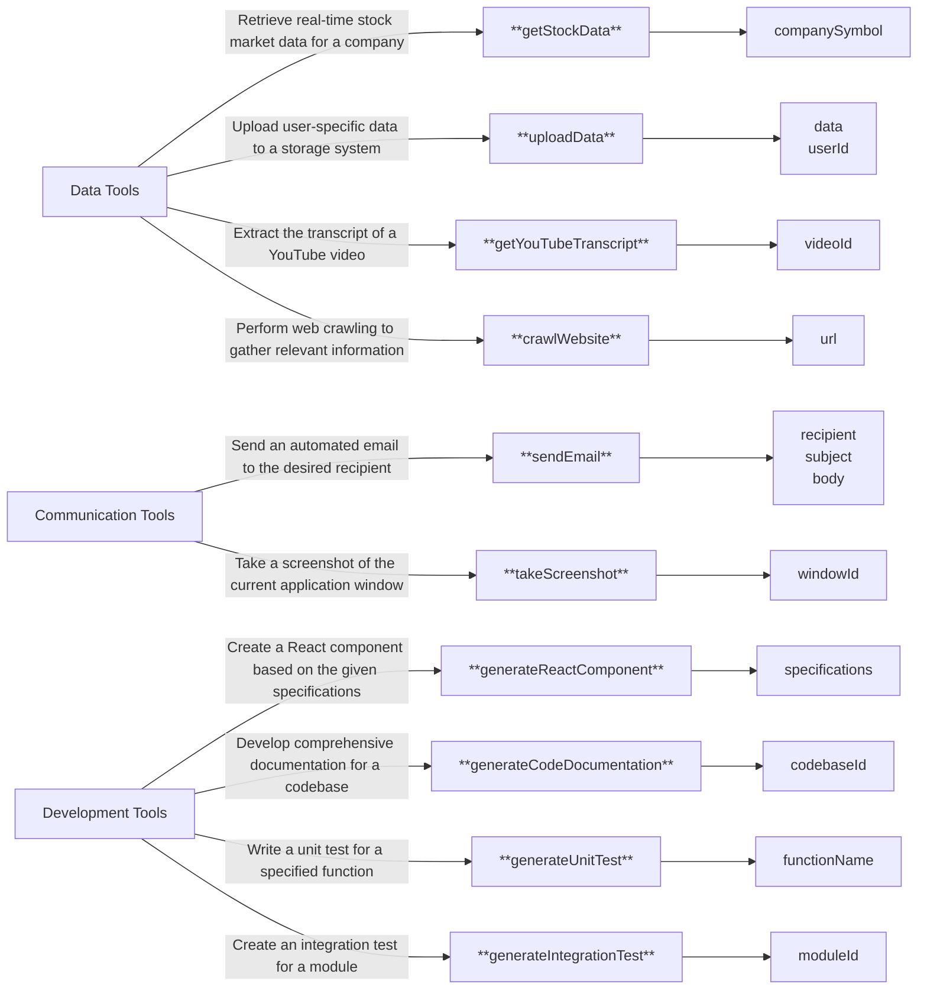

# json-schema-to-diagram

> 🧜‍♀️ Generate Mermaid diagrams from JSON schemas of e.g., function calling tools.

This is a simple tool that uses OpenAI's LLM to generate a Mermaid diagram from a JSON schema of tools. It can be used to visualize your agentic architecture through a diagram that shows all your tools and their parameters.

You can for example use this tool to generate a diagram and append it to your README.md or use it in your project's documentation.

## Example Diagram

Here's how a Mermaid diagram generated from a JSON schema of [OpenAI function calling tools](https://platform.openai.com/docs/guides/function-calling) looks like:



## Install

```sh
npm install --save-dev json-schema-to-diagram
```

## Usage

```js
import jsonSchemaToDiagram from "json-schema-to-diagram";

const TOOLS = {
  // JSON schema of your function calling tools
  // For example your OpenAI function calling tools
};

// Append the diagram to your README.md file
(async () => {
  try {
    await jsonSchemaToDiagram({
      filePath: "./README.md",
      jsonSchema: TOOLS,
    });
    console.log("Diagram appended successfully.");
  } catch (error) {
    console.error("Error appending diagram:", error);
    process.exit(1);
  }
})();
```

## API

### generateDiagram(options)

#### options.filePath

Type: `string`

The path to the file to update (default: `./README.md`).

#### options.startMarker

Type: `string`

The start marker of the diagram in the file (default: `<!-- MERMAID_DIAGRAM_START -->`).

#### options.endMarker

Type: `string`

The end marker of the diagram in the file (default: `<!-- MERMAID_DIAGRAM_END -->`).

#### options.systemPrompt

Type: `string`

The system prompt for the LLM (default: `You are a helpful assistant that generates mermaid diagrams based on a JSON schema of tools.`).

#### options.model

Type: `Model`

The LLM model to use (default: `openai("gpt-4o")`). This uses [ai](https://github.com/vercel/ai) under the hood.

#### options.jsonSchema

Type: `string`

The JSON schema of the tools.
